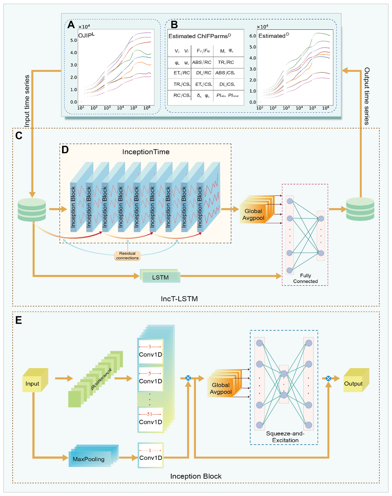
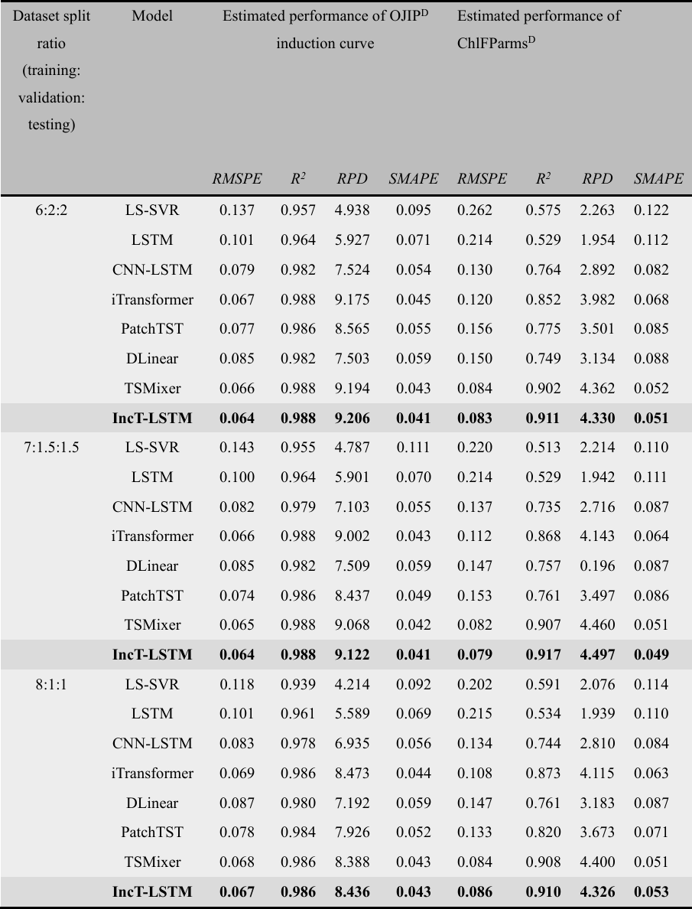
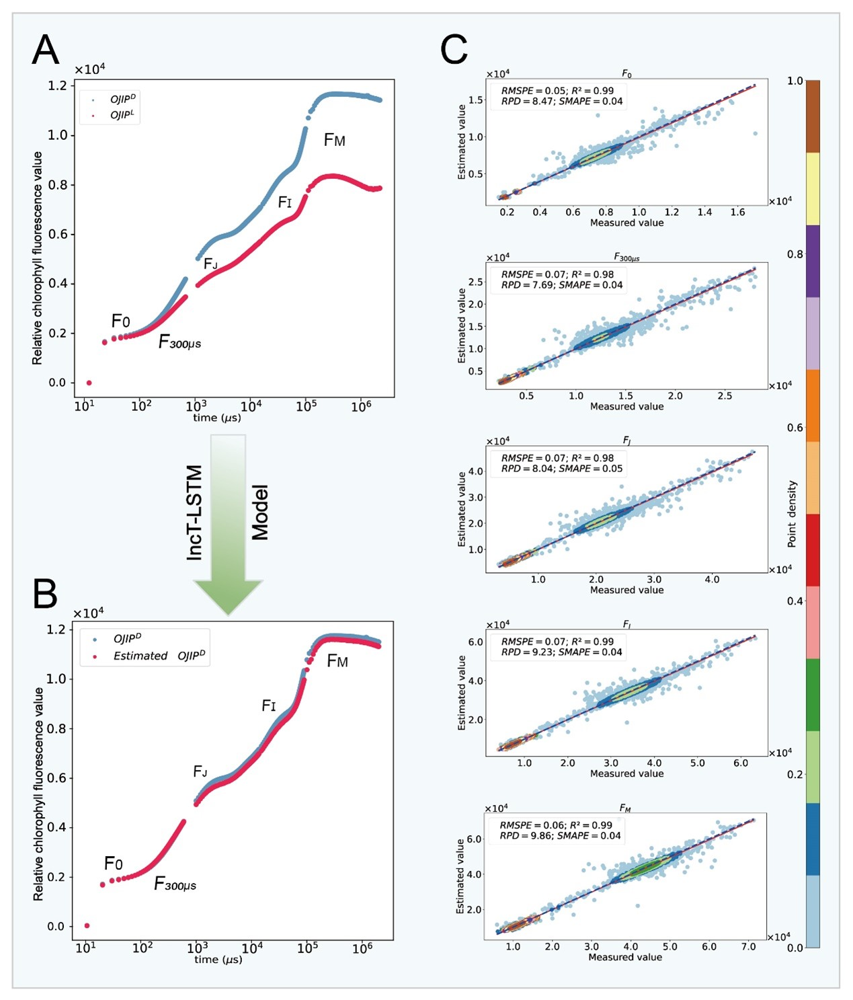
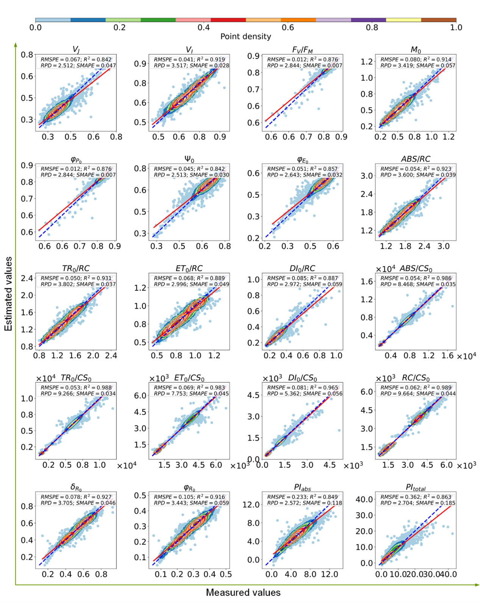

## Determination of Dark-adapted Chlorophyll a Fluorescence Characteristics of Plant Leaves from Measurements under Light-adapted Conditions through Deep Learning

In this study, we developed an IncT-LSTM model to estimate the OJIP induction curve and chlorophyll fluorescence parameters under dark adaptation based on the OJIP induction curve measured under light adaptation. We compared this model with common traditional machine learning methods such as LS-SVR, as well as typical time series prediction models including LSTM, CNN-LSTM, iTransformer, PatchTST, DLinear, and TSMixer. The results demonstrated that the InceptionTime-LSTM model exhibited the best estimation performance and optimal stability. The models included in the comparison were modified versions of the following base models:

\[LS-SVR]:https://github.com/zealberth/lssvr
\[CNN-LSTM]:https://github.com/Xiaohan-Chen/bear_fault_diagnosis
\[iTransformer,PatchTST,DLinear,TSMixer]:https://github.com/thuml/Time-Series-Library

### Requirements
All the code was implemented in Python. The training, validation, and testing of the InceptionTime-LSTM model were conducted on the following platform: Intel(R) Core(TM) i5-9400F CPU @ 2.90GHz, Ubuntu 23.04, GeForce GTX 1660 Ti (6G), Python 3.8.10, CUDA 11.8, and PyTorch 2.0.1.

### Model

### Evaluation

#### 1. Performance comparison of various models
Performance comparison of various models (LS-SVR, LSTM, CNN-LSTM, iTransformer, PatchTST, DLinear, TSMixer, IncT-LSTM) in estimating the OJIPD induction curve and ChlFParmsD based on the test set (dataset split: 20%, 15%, and 10%). The comparison metrics include the RMSPE, R2, RPD, and SMAPE. The rows highlighted in bold indicate that the IncT-LSTM model consistently exhibits the best estimation performance across all dataset split ratios.

#### 2. Estimated $OJIP^D$ results using the IncT-LSTM model

(A) OJIP induction curve measured with (blue) and without (red) dark adaptation; (B) Comparison between the measured (blue) and estimated (red) $OJIP^D$ curves; (C) Estimated results of key characteristic values for the $OJIP^D$ curve with the test dataset. Each subplot displays one characteristic value of the $OJIP^D$ curve, with the x-axis representing the measured values under dark adaptation conditions and the y-axis representing the values estimated by the IncT-LSTM model. The red line is a linear regression line, and the blue dashed line is the 1:1 line (overlapped with each other). From (A) and (B), it can be observed that the $OJIP^L$, after model estimation, perfectly aligns with $OJIP^D$, while (C) shows that the regression line for the samples nearly perfectly coincides with the 1:1 line, indicating the model’s excellent estimation performance. Note that $F_0$, $F_{300 μs}$, $F_J$, $F_I$, and $F_M$ are five transitional points on the OJIP curve, representing different redox states of the photosynthetic reaction system.

#### 3. Data distribution of measured $ChlFParms^D$ values vs. those estimated with the IncT-LSTM model

Each subplot represents a different $ChlFParms^D$ value, with the x-axis indicating the measured values and the y-axis the estimated values. The red line is a linear regression line, and the blue dashed line is the 1:1 line. The regression lines for all $ChlFParms^D$ estimated values closely coincide with the 1:1 line, demonstrating the strong estimation performance of the IncT-LSTM model. The color gradient from light to dark (from light blue to brown) represents the data distribution density, indicating a transition from sparse to dense.
